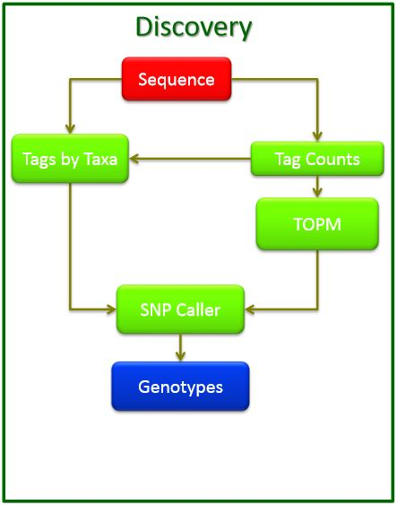
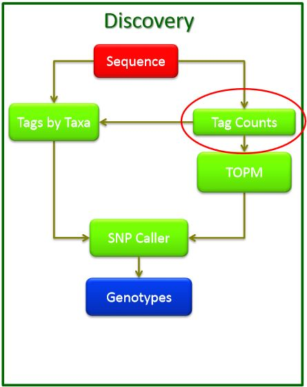
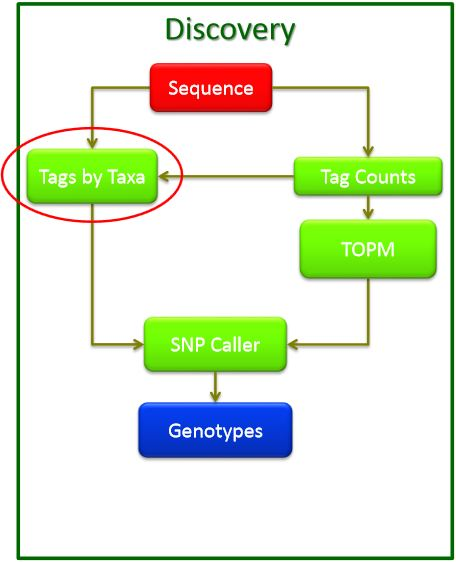
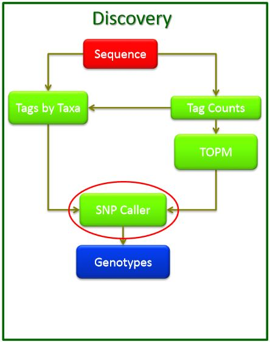

## How to edit this document

The master version of this document is on *[github](https://github.com/biospectrabysequencing/gbs_moa)*. This printing is version *[`r system("git rev-parse --short HEAD", intern=TRUE)`](https://github.com/biospectrabysequencing/gbs_moa/commit/`r system("git rev-parse --short HEAD", intern=TRUE)`)* from that repository, last modifed *`r format(Sys.time(), "%d %b %Y")`*


<!-- ---------------------- Page 2------------------------ -->
WARNING: SMART CHOICES vs DEFAULTS vs TUTORIAL SETTINGS
----------------------


The default settings for the steps in the GBS pipeline as well as
those in this tutorial are not appropriate for your real life data.
This tutorial is intended to get you familiar with the mechanics of
running the pipeline. 

It is not meant as a guide to running the pipeline on your unique set of data. To analyze your data, you will need to be familiar with the genetics of your system and samples as well as the settings for each of the steps. 

Tuning the pipeline is an iterative process and best done with a data set for which you can have testable expectations of the outcome (e.g. a
mapping population). 

The pipeline will give you SNP markers at the end, but it is up to you to make sure that they are good markers.


<!-- ---------------------- Page 3------------------------ -->
## UNIX SHELL COMMANDS


```{r list_directory_contents, engine='asis'}
ls
```
–

```{r change_directory, engine='asis'}
cd
```

```{r display_file_contents, engine='asis'}
less [ FILENAME ]
```


<!-- ---------------------- Page 4------------------------ -->
## TASSEL PIPELINE AND XML FILES

XML files are structured text files. In this case they are used to store
configuration information for running TASSEL plugins.

You can open up the xml file with less or a text editor.

You can regenerate the command line like this:

```{r engine="asis"}
./run_pipeline.pl -translateXML config.xml
```


******

<!-- ---------------------- Page 5------------------------ -->
### SNP Discovery worflow



<!-- --------------------- Page 6,7----------------------- -->
### Count GBS Tags



<!-- 
## Fixing xml snippets...
perl -ne 'if(m/(\>|^$)/){print} else {s/\n//g; print}' [FILE] 
-->

```
cd /mnt/workshop/data/02_TagCounts/01_IndividualTagCounts/
  
run_pipeline.pl -Xms512m -Xmx1g -configFile ./FastqToTagCounts.xml

<xml version="1.0" encoding="UTF-8" standalone="no"?>
 <TasselPipeline>
    <fork1>
        <FastqToTagCountPlugin>
            <i>../../01_RawSequence</i>
            <o>./</o>
            <k>../../50_KeyFiles/GBS_Workshop_Maize_key.txt</k>
            <e>ApeKI</e>
            <s>3000000</s>
            <c>1</c>
        </FastqToTagCountPlugin>
    </fork1>
    <runfork1/>
</TasselPipeline>
```

<!-- ---------------------- Page 8------------------------ -->
### Merge tag count files

```
cd/mnt/workshop/data/02_TagCounts/02_MergedTagCounts

run_pipeline.pl-Xms512m-Xmx1g-configFile./MergeTagCounts.xml

<?xml version="1.0" encoding="UTF-8" standalone="no"?>
<TasselPipeline>
  <fork1>
  <MergeMultipleTagCountPlugin>
  <i>../01_IndividualTagCounts</i>
  <o>./GBS_Workshop_Maize.cnt</o>
  <c>5</c>
  </MergeMultipleTagCountPlugin>
  </fork1>
  <runfork1/>
</TasselPipeline>
```

******

<!-- ---------------------- Page 9------------------------ -->
### Tags on physical map (TOPM)


<!-- ---------------------- Page 10----------------------- -->
### CONVERT TO FASTQ

```
cd/mnt/workshop/data/02_TagCounts/03_TagCountToFastq

run_pipeline.pl -Xms512m -Xmx1g -configFile TagCountToFastq.xml

<?xml version="1.0" encoding="UTF-8" standalone="no"?>
<TasselPipeline>
  <fork1>
  <TagCountToFastqPlugin>
  <i>../02_MergedTagCounts/GBS_Workshop_Maize.cnt</i>
  <o>./GBS_Workshop_Maize.fq.gz</o>
  <c>5</c>
  </TagCountToFastqPlugin>
  </fork1>
  <runfork1/>
</TasselPipeline>
```

<!-- ---------------------- Page 11----------------------- -->
### ALIGN GBS TAGS TO REFERENCE GENOME

```
cd/mnt/workshop/data/03_SAM/

bowtie2 -M 4 -p 15 --very-sensitive-local \
  -x ../53_AlignerIdices/GBS_Workshop_Maize \
  -U ../02_TagCounts/03_TagCountToFastq/GBS_Workshop_Maize.fq \
  -S GBS_Workshop_Maize.sam
```

<!-- ---------------------- Page 12----------------------- -->
### CONVERT SAM TO TAGS ON PHYSICAL MAP (TOPM)

```
cd/mnt/workshop/data/04_TOPM/

run_pipeline.pl -Xms 512m -Xmx 1g -configFile SAMConverter.xml

<?xml version="1.0" encoding="UTF-8" standalone="no"?>
<TasselPipeline>
<fork1>
<SAMConverterPlugin>
  <i>../03_SAM/GBS_Workshop_Maize.sam</i>
  <o>./GBS_Workshop_Maize.topm</o>
  </SAMConverterPlugin>
  </fork1>
  <runfork1/>
</TasselPipeline>
```

<!-- ---------------------- Page 13----------------------- -->




<!-- ---------------------- Page 14----------------------- -->
### MATCH TAGS TO SAMPLES (TAXA)


```
cd /mnt/workshop/data/05_TBT/01_IndividualTBT

run_pipeline.pl -Xms 512m -Xmx 1g -configFile SeqToTBTHDF5Plugin.xml

<?xml version="1.0" encoding="UTF-8" standalone="no"?>
<TasselPipeline>
  <fork1>
  <SeqToTBTHDF5Plugin>
  <i>../../01_RawSequence</i>
  <k>../../50_KeyFiles/Pipeline_Testing_key.txt</k>
  <e>ApeKI</e>
  <o>./GBS_Workshop_Maize.h5</o>
  <s>100000000</s>
  <L>GBS_Workshop_MaizeTBTHDF5_Log.txt</L>
  <t>../../02_TagCounts/02_MergedTagCounts/GBS_Workshop_Maize.cnt</t>
  </SeqToTBTHDF5Plugin>
  </fork1>
  <runfork1/>
</TasselPipeline>
```

<!-- ---------------------- Page 15----------------------- -->
### PIVOT THE TBT TO PREPARE FOR SNP CALLING

```
cd/mnt/workshop/data/05_TBT/04_PivotMergedTaxaTBT

run_pipeline.pl -Xms 512m -Xmx 1g -configFile ./PivotTaxaTBTHDF5.xml

<?xml version="1.0" encoding="UTF-8" standalone="no"?>
<TasselPipeline>
  <fork1>
  <ModifyTBTHDF5Plugin>
  <o>../01_IndividualTBT/GBS_Workshop_Maize.h5</o>
  <p>./PivotTaxaTBTHDF5.h5</p>
  <c></c>
  </ModifyTBTHDF5Plugin>
  </fork1>
  <runfork1/>
</TasselPipeline>

```

<!-- ---------------------- Page 16----------------------- -->



<!-- ---------------------- Page 17----------------------- -->
### CALL SNPS

```
cd/mnt/workshop/data/06_HapMap/

run_pipeline.pl -Xms 512m -Xmx 1g -configFile ./SNP_Caller.xml

<?xml version="1.0" encoding="UTF-8" standalone="no"?>
<TasselPipeline>
  <fork1>
  <TagsToSNPByAlignmentPlugin>
  <i>../05_TBT/04_PivotMergedTaxaTBT/PivotTaxaTBTHDF5.h5</i>
  <o>./GBS_Workshop_Maize_chr+.hmp.txt</o>
  <m>../04_TOPM/GBS_Workshop_Maize.topm</m>
  <mnF>0.8</mnF>
  <mnMAF>0.02</mnMAF>
  <mnMAC>100000</mnMAC>
  <s>9</s>
  <e>10</e>
  </TagsToSNPByAlignmentPlugin>
  </fork1>
  <runfork1/>
</TasselPipeline>
```

<!-- ---------------------- Page 17----------------------- -->


