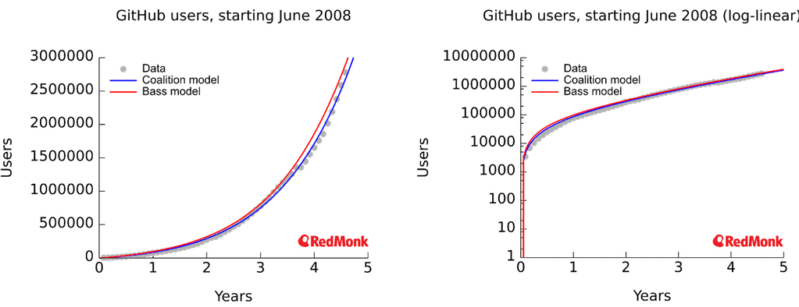
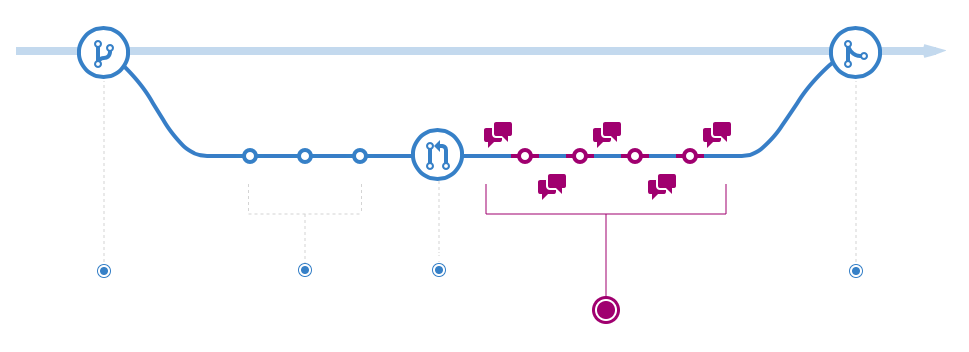
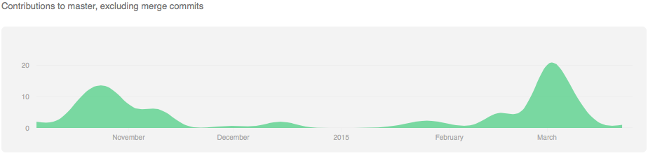
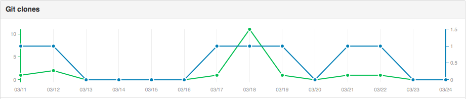

## Collaborate and Replicate

### Introduction

- Reproducible Research
- using [GitHub](http://github.com) for [Biospectra By Sequencing](https://github.com/biospectrabysequencing)
- using [Moa](https://github.com/mfiers/moa)

## The Reproducibility Spectrum


<div align=right><span style="font-size: 0.5em">Image from [@peng2011]</span></div>

### aim

* towards right hand side
* evaluate findings
* journals also moving this way

## Best Practices

-------------------------------- | -------------------
Program for people not computers | Plan for mistakes (test suites)
Make the computer do the work    | Optimize when everything works
Use version control for changes  | Document design and purpose
Don't repeat yourself or others  | Collaborate

[@wilson2014]

##


* https://github.com/blog/1840-improving-github-for-science

## GitHub growth



[@berkholz2013]

## GitHub - is it really for us?

### Reduce barriers to collaboration

* Collaborate
    + Multiple organisations (AgR, Massey, PFR, NZGL)
    + Multiple sites (AKL, PN, TP)
* Hosted and free
* `git clone`
* Network access and Administration
* Markdown Documents (like this one)
* Third party integrations
* User experience
* Metrics

## Collaborate and Replicate

Propagate filesystem to all members

```{r engine="bash", results="hide", echo="FALSE"}
## https://support.rstudio.com/hc/communities/public/questions/200694007-rpostback-askpass
export SSH_ASKPASS="/usr/lib/rstudio-server/bin/postback/rpostback-askpass"
export GIT_SSH="ssh -o ForwardX11=no -o ForwardX11Trusted=no"
unset DISPLAY
```

```{r engine="bash", cache="TRUE"}
git clone git@github.com:biospectrabysequencing/gbs_moa.git
cd gbs_moa
ls -l
```

##



* Conversations about changes (notifications)
* Pull Request == Review
    + quality control
    + automated test/build
    + peer pressure for poor code/docs/repetition etc...

## Integrations

* Project management
    + http://waffle.io
    + Tasks, issues and pull requests
* Continuous Integration
    + http://travis-ci.org, http://circleci.com, etc...
    + Automation
    + Plan for mistakes

## Metrics





## Challenges

* Account management
* Skills
* Research output recognition?

## Moa

*Command line workflows in bioinformatics*

* Developed in Python by [@fiers2014]
* Organized:

*Moa facilitates project organization in many (smaller and more major) ways by providing a uniform way to capture commands as Moa jobs. Each Moa job is linked to a specific directory, which contains all **configuration**, **template**, **data**, and intermediate data available as files within the directory structure.*

* Documented
* Reproducible
* Reusable & Shareable
* Flexible

From simple bash data wrangling to map and reduce across a cluster

## Organisation

* Use numeric directory naming for ordering of steps
* Granularity of work within directory
* Each directory has a template for the work
* Templates are expanded based on the values of variables
* Research activity can be tracked within git
* Enables iterative and automatic workflow

## Usage

* `moa simple`
* `moa new` - specify a template
* `moa set` - set variables for expansion in templates
* `moa show`
* `moa status`
* `moa run`

## Summary

Many of the best practices of [@wilson2014] are achievable using GitHub and Moa.

## Acknowledgements {.smaller}

* Helge Dzierzon
* Rob Elshire
* Mark Fiers 
* Shane Sturrock


## References
